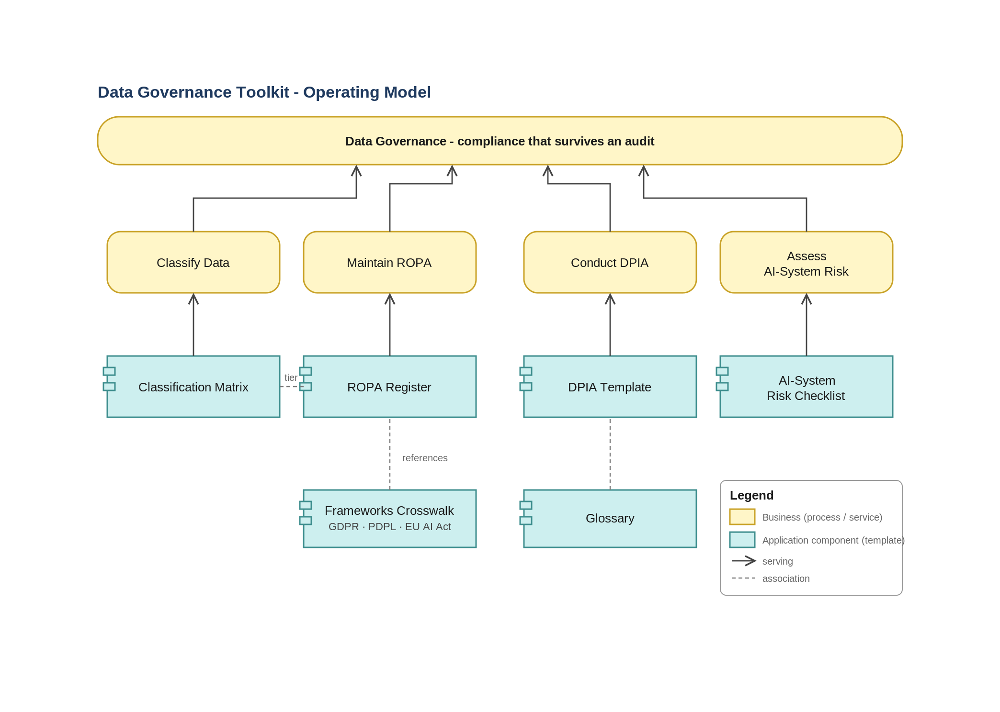
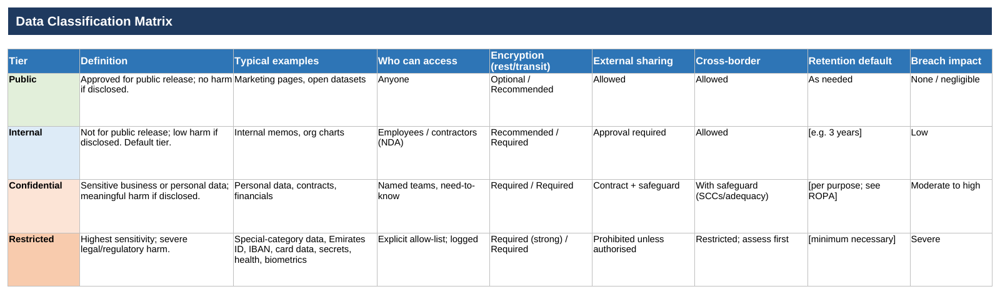
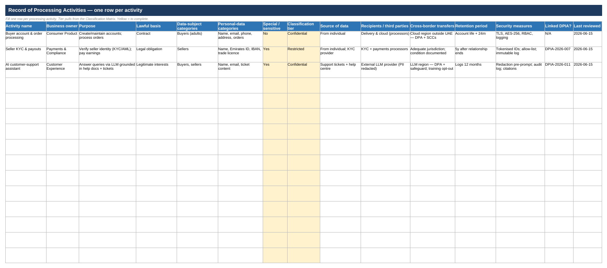

# Data Governance Toolkit

**Practical, ready-to-use data-governance templates for regulated teams — bilingual (English now, العربية next).**

> Built for the compliance reality you're actually facing. The **UAE PDPL** is in force and its Executive Regulations are sharpening what compliance requires, with the UAE Data Office issuing guidance and enforcement ramping up; the **EU AI Act**'s high-risk obligations are phasing in. This toolkit gives data leads, DPOs, and engineers the operational artefacts those regimes ask for — ROPA, DPIA, data classification, and an AI-system risk checklist — as fill-in-the-blanks documents you can use on Monday.

This is the operational side of governance: not the law, but the paperwork the law expects you to have.

---

## Who this is for

- **Data & analytics leads** standing up governance in a regulated or GCC organisation.
- **DPOs / privacy officers** who need a register and an assessment template that map to GDPR, UAE PDPL, and the EU AI Act.
- **Engineers** building data and AI systems who need to know what "compliant by design" actually requires.

## What's inside

| Template | Use it when… | Files |
|---|---|---|
| **Data Classification Matrix** | You need a shared definition of Public / Internal / Confidential / Restricted and the handling rules for each. | [`templates/data-classification/`](templates/data-classification/) |
| **ROPA — Record of Processing Activities** | You need a GDPR Art. 30 / PDPL processing register. | [`templates/ropa/`](templates/ropa/) |
| **DPIA — Data Protection Impact Assessment** | A project involves high-risk, large-scale, or new-technology processing. | [`templates/dpia/`](templates/dpia/) |
| **AI-System Risk Checklist** | You're putting an AI/LLM system anywhere near personal or regulated data. | [`templates/ai-system-risk-checklist/`](templates/ai-system-risk-checklist/) |

Plus a [frameworks crosswalk](docs/frameworks-crosswalk.md) (GDPR ↔ UAE PDPL ↔ EU AI Act) and a [glossary](docs/glossary.md).

## Architecture / how the pieces fit

The toolkit models a small governance operating model: classification underpins everything, the ROPA records what you process, the DPIA assesses high-risk processing, and the AI risk checklist gates AI systems before they touch data.

*Editable source: [`toolkit-overview.drawio`](assets/architecture/toolkit-overview.drawio) (open in [draw.io](https://app.diagrams.net) or the VS Code Draw.io extension).*

## Preview

The data classification matrix (`.xlsx`), colour-coded by sensitivity:

The ROPA register with the synthetic **SoukNova** example filled in — note how a single Restricted activity (seller KYC: Emirates ID + IBAN) links to a DPIA:

## Quickstart

1. **Pick** the template you need from the table above.
2. **Copy** it and fill the `[bracketed]` fields — every template ships with a field-by-field guide.
3. **Review** the completed artefact with your DPO / legal function before relying on it.

## Frameworks covered

`GDPR (EU 2016/679)` · `UAE PDPL (Federal Decree-Law No. 45 of 2021 + Executive Regulations)` · `EU AI Act (Regulation 2024/1689)`

See the [crosswalk](docs/frameworks-crosswalk.md) for how a single artefact satisfies obligations across regimes.

## Bilingual

English templates are first. Arabic (العربية) versions ship as a parallel `-ar` file beside each English file — in progress. ⭐ the repo to follow the Arabic release.

## Disclaimer

This toolkit is **not legal advice**. It is a set of starting-point templates. Always validate completed artefacts against the regulations that apply to you and with qualified counsel. See [`DISCLAIMER.md`](DISCLAIMER.md).

## License

[MIT](LICENSE) — use, adapt, and redistribute freely.

---

*Maintained by [Mohamed](https://github.com/mmubarak-io). Building data & AI that survives an audit, in regulated industries.*
